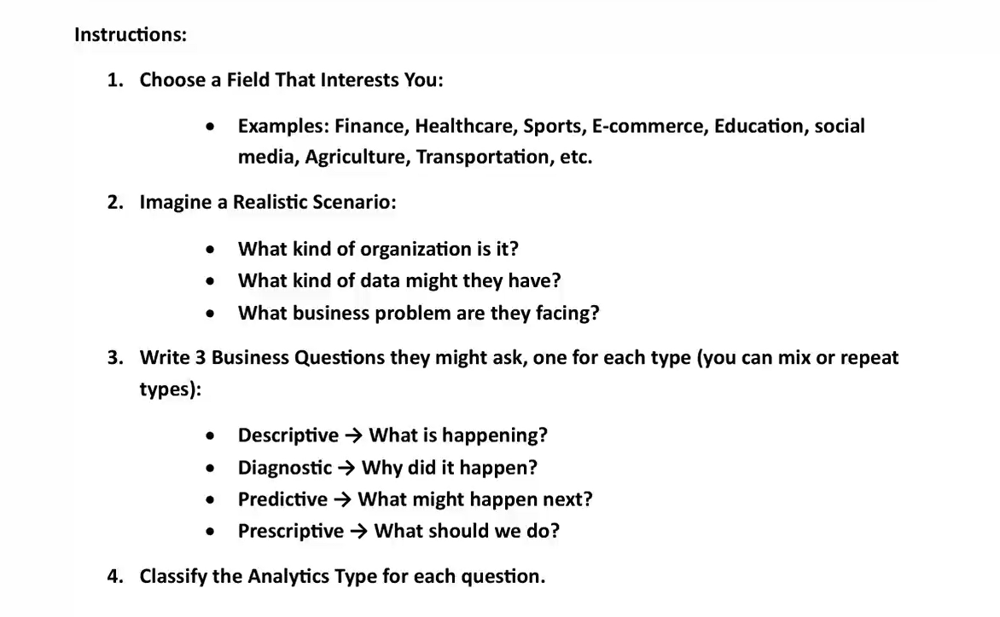

# Lab

## Task 1: What type of data analytics is being used in the following scenarios?

* **What were our total sales last month?**
    * Descriptive Data Analytics

* **Why did sales drop at the Airport store in February?**
    * Diagnostic Data Analytics

* **Will our sales improve next month if the weather stays sunny?**
    * Predictive Data Analytics

* **What marketing strategy should we use next month to boost sales?**
    * Prescriptive Data Analytics

* **Which store had the highest number of promo code redemptions?**
    * Descriptive Data Analytics

---

## Task 2: Data Analytics Case Study

**1. Field**: Sports (Football)

**2. Scenario**

* **What kind of Organization is it?** 
    * A football club's data analytics team.

* **What kind of Data might they have?** 
    * Player fitness levels (running distance, speed, heart rate), match performance (passes, shots, tackle success), and injury records.

* **What Business Problem are they facing?** 
    * The team's performance dropped badly, and many key players got injured, costing the club points and money.

**3 & 4. Business Questions**

1. **How many wins and injuries did we have in the second half of the season?**
    * Descriptive Data Analytics

2. **Why were players getting injured late in matches toward the end of the season?**
    * Diagnostic Data Analytics

3. **Which players are most at risk of injury in the next few matches?**
    * Predictive Data Analytics

4. **How should we rotate players to avoid future injuries?**
    * Prescriptive Data Analytics