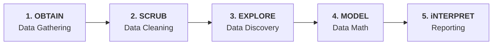

# Data Analytics & Business Intelligence Cheat Sheet

A comprehensive, clear reference guide aligned with course material covering core data terminology, analytical frameworks, goal-setting methodologies, tools, and organization profiles.

---

## 1. Core Concepts: Data Analysis vs. Data Analytics

* **Data Analysis Definition:** The practice of examining data to answer questions, identify trends, and extract insights. When data analytics is applied within a commercial context, it is often termed **Business Analytics**.

* **Key Differences:** While Data Analysis focuses on evaluating historical data, Data Analytics encompasses a broader scope including predictive and prescriptive methods.

| Dimension | Data Analysis | Data Analytics |
| --- | --- | --- |
| **Focus** | Examining and interpreting historical data to identify patterns. | Encompasses analysis plus predictive and prescriptive decision-making. |
| **Primary Aim** | Understand what has happened through data summarization and visualization. | Predict future outcomes and prescribe optimal business actions. |
| **Time Scope** | **Current Being** (Historical / Present). | **Current Being & Future**. |
| **Core Goals** | **Describe & Diagnose**. | **Predict & Prescribe**. |
| **Primary Tools** | Basic tools such as **Excel** and **SQL**. | Advanced tools including **statistical software** and **machine learning libraries**. |

---

## 2. Real-World Applications of Data Analytics

Data analytics frameworks are commonly applied across five primary industry domains:

1. **Retail & E-Commerce:** Tracking customer purchasing habits and inventory levels.
2. **Healthcare:** Analyzing patient data and epidemiological trends.
3. **Finance & Banking:** Risk assessment, transaction monitoring, and fraud detection.
4. **Manufacturing & Supply Chain:** Optimizing production lines and logistics workflows.
5. **Marketing & Social Media:** Measuring campaign engagement and consumer sentiment.

---

## 3. The 4 Types of Data Analytics

Data analytics progresses along a maturity curve: as organizational **value** increases, technical **complexity** scales from analyzing past events to automating future decisions.

| Analytics Type | Core Question | Focus & Scope | Key Tools & Tech | Primary Roles | Practical Slide Examples |
| --- | --- | --- | --- | --- | --- |
| **Descriptive** | *What happened?* | Summarizes historical data to identify patterns and trends. | SQL, Excel, Power BI. | Data Analyst, Business Analyst. | *"What were our total sales last month?"* / *"Which store had the highest promo redemptions?"* |
| **Diagnostic** | *Why did it happen?* | Drills down into data to discover root causes of past outcomes. | Python, R, SQL. | Data Analyst, Business Analyst. | *"Why did sales drop at the Airport store in February?"* |
| **Predictive** | *What is likely to happen?* (*What will happen?*) | Uses statistical models and ML to forecast future outcomes. | Python, R, SAS, IBM SPSS. | Data Scientist, Machine Learning Engineer. | *"Will our sales improve next month if the weather stays sunny?"* |
| **Prescriptive** | *What should we do?* (*How can we make it happen?*) | Recommends optimal actions using optimization and simulation. | Python, R, SAS, IBM ILOG CPLEX Optimization Studio. | Data Scientist, Operations Research Analyst. | *"What marketing strategy should we use next month to boost sales?"* |

---

## 4. Defining Business Intent: SMART Goals & KPIs

Before querying data, analysts must establish business objectives and define performance indicators.

### A. Setting SMART Business Goals

Transform business needs into structured **SMART** goals:

* **S — Specific:** State clearly what you will do using concrete action words.
* **M — Measurable:** Provide a clear way to evaluate progress using metrics or quantitative targets.
* **A — Achievable:** Ensure the target is attainable and realistic within existing scope and resources.
* **R — Relevant:** Ensure the objective aligns with job functions and directly improves the business.
* **T — Time-bound:** Define explicit deadlines or timeframes for completion.

---

### B. Determining Key Performance Indicators (KPIs)

KPIs are specific measurable values used to monitor progress toward a defined strategic goal.

* **Key Characteristics of KPIs:**
    * **Quantitative:** Expressed as measurable numeric metrics.
    * **Strategic Alignment:** Directly reflect and align with broader organizational targets.
    * **Clarity:** Must be clear, specific, and unambiguous.
    * **Actionable Insights:** Provide data-driven guidance for operational adjustments and decision-making.

---

## 5. The End-to-End Data Lifecycle: The OSEMN Framework

The **OSEMN** framework outlines the five core steps of a data science project lifecycle (attributed to Dr. Cher Han Lau):

1. **Obtain:** Ingesting and collecting raw data from various data sources.
2. **Scrub:** Cleaning, normalizing, and transforming raw data into a reliable format.
3. **Explore:** Performing exploratory data analysis to discover patterns, trends, and anomalies.
4. **Model:** Applying statistical techniques, formulas, or machine learning algorithms to perform predictions or simulations.
5. **iNterpret:** Translating findings into clear visual reports, dashboards, and strategic recommendations.

---

## 6. Core Tools & Technical Environments

Key platforms and programming environments utilized across data analytics tasks:

* **Excel:** Core tool for introductory data analysis, quick calculations, and baseline reporting.
* **SQL (Structured Query Language):** Fundamental language for database querying, extraction, and data manipulation.
* **Power BI & Power Services:** Business intelligence platforms used for dashboard creation and report publishing.
* **Tableau:** Specialized platform for enterprise data visualization.
* **Python:** Advanced programming language used for data analysis, statistical operations, and machine learning.
* **R:** Language designed specifically for statistical computing, data modeling, and advanced graphics.

---

## 7. Job Profiles & Team Structures: Small vs. Big Companies

Organizational size determines how analytics responsibilities are divided across teams.

### A. Small Company Setup (Generalist Model)

In smaller organizations, a single **Data Analyst** handles the end-to-end analytics process independently:

* **Workflow:** Stakeholders ask business questions $\rightarrow$ Data Analyst searches across Data Sources (Databases, REST APIs, Web Forms, Spreadsheets) $\rightarrow$ Data is collected $\rightarrow$ Analyst executes analysis (e.g., in Excel) $\rightarrow$ Visualizations are built $\rightarrow$ Final report is delivered to stakeholders.

---

### B. Big Company Setup (Specialized Roles)

In enterprise environments, analytics operations are divided among specialized professionals:

* **Data Architect:** Designs master database structures, schemas, and overall data enterprise architecture.
* **Data Engineer:** Builds pipelines, manages server connectivity, executes ETL workflows, and maintains the Data Warehouse.
* **BI Developer:** Constructs structured data models (Fact and Dimension tables) and builds automated executive dashboards.
* **Data Analyst:** Extracts data from the warehouse to answer stakeholder questions and publish decision-oriented reports.
* **Data Scientist:** Conducts statistical experiments, builds predictive algorithms, and tests hypotheses.
* **ML Engineer:** Deploys trained machine learning models to production servers, APIs, and client-facing applications.