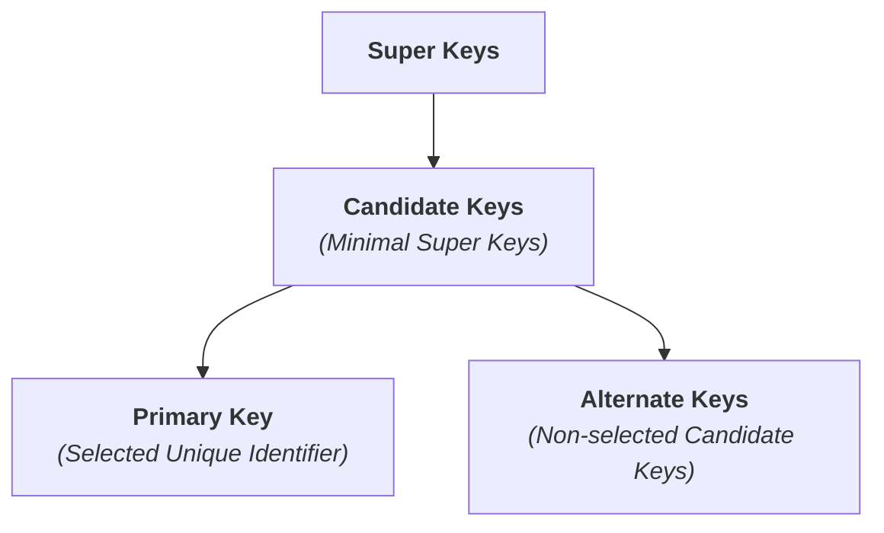
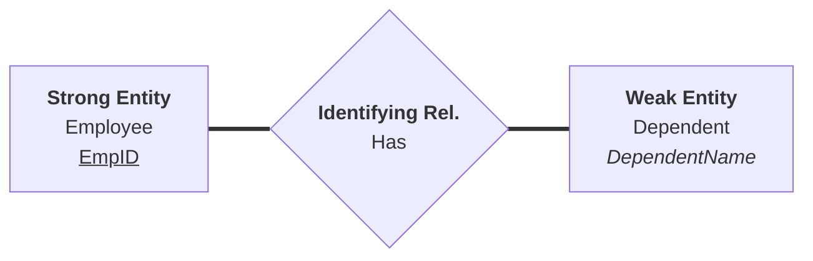

# Database Design & ERD to Relational Mapping Cheat Sheet

A comprehensive reference guide covering relation attributes, weak entity sets, participation constraints, ERD relationship reading rules, and exact conversion rules from Entity-Relationship Diagrams (ERDs) to Relational Schemas.

---

## 1. Relation & Attribute Fundamentals

A **Relation** is a two-dimensional table composed of **Tuples** (rows) and **Attributes** (columns). Every attribute operates over an atomic **Domain** (the permitted set of values).

### A. Attribute Types in Database Design

| Attribute Type | ERD Notation | Relational Database Representation | Example |
| --- | --- | --- | --- |
| **Simple (Atomic)** | Oval | Becomes a standard column in the relation. | `salary` column in `Employee` |
| **Composite** | Oval branching into sub-ovals | **Flattened.** Sub-attributes become individual columns; parent attribute is omitted. | `Name` $\rightarrow$ `first_name`, `last_name` |
| **Multi-valued** | Double Oval | **Separate Table.** Extracted into a child table containing Parent PK + Attribute Value. | `Skills` $\rightarrow$ `Employee_Skills` table |
| **Derived** | Dashed Oval | **Omitted from physical tables.** Calculated dynamically via SQL views or computed columns. | `age` calculated from `date_of_birth` |
| **Key Attribute** | Underlined text | Designated as the **Primary Key (PK)** with `UNIQUE` and `NOT NULL` constraints. | `emp_id` in `Employee` |

---

### B. The Key Hierarchy

* **Super Key:** Any set of one or more attributes that collectively identifies a unique tuple in a relation.
* **Candidate Key:** A minimal Super Key—a super key from which no attribute can be removed without losing unique identification.
* **Primary Key (PK):** The candidate key selected by the database designer to uniquely identify tuples. Cannot contain `NULL` values.
* **Alternate Key:** Any candidate key that was not chosen as the primary key.
* **Foreign Key (FK):** An attribute (or set of attributes) in one relation that references the Primary Key of another relation, enforcing **Referential Integrity**.

---

## 2. Weak Entities & Identifying Relations

A **Weak Entity** cannot be uniquely identified by its own attributes alone and depends on a **Strong (Owner) Entity** for its identity and existence.

> ### Key Elements of Weak Entities
>
> * **Partial Key (Discriminator):** An attribute that uniquely distinguishes weak entity instances *belonging to the same owner entity* (represented with a **dashed underline**, e.g., `DependentName`).
> * **Identifying Relationship:** The relationship linking the weak entity to its owner (represented by a **double diamond**). The weak entity always exhibits **Total Participation** in this relationship.

---

## 3. Participation Constraints (Total vs. Partial)

Participation constraints define whether an entity's existence requires participating in a specific relationship.

| Constraint | ERD Notation | Meaning | SQL Enforcement | Practical Example |
| --- | --- | --- | --- | --- |
| **Total Participation** *(Mandatory)* | **Double Line** | **Every** entity instance in the set must participate in at least one relationship instance. | `NOT NULL` on Foreign Key, or `CHECK` / Trigger constraints. | Every `Employee` **must** belong to a `Department`. |
| **Partial Participation** *(Optional)* | **Single Line** | Entity instances **can exist without** participating in the relationship. | Foreign Key allows **`NULL`** values. | A `Department` **may** have a manager assigned (some don't). |

---

### Matrix: How Participation Dictates Foreign Key Design

| Cardinality | Participation Combination | Relational Strategy |
| --- | --- | --- |
| **1:1** | Partial — Partial | Create a **Separate Relationship Table** to prevent `NULL` values in both base tables. |
| **1:1** | Total — Partial | Put Foreign Key in the **Total side** table and set column to **`NOT NULL`**. |
| **1:1** | Total — Total | **Merge both entities into a single table** or use deferrable foreign keys in both directions. |
| **1:N** | Many Side: Total | Put Foreign Key on the **Many side** and set column to **`NOT NULL`**. |
| **1:N** | Many Side: Partial | Put Foreign Key on the **Many side** with **`NULLable`** permission, or use a separate bridge table. |
| **M:N** | Any Combination | Always create a **Separate Junction Table**. Participation is handled by inserting or omitting rows in the junction table. |

---

## 4. Practical Guide: How to Read ERD Relationships

To interpret any relationship between two entities accurately, always read the diagram in **both directions** (Left-to-Right and Right-to-Left). Combine the **Participation** (Line style) with the **Cardinality** (Ratio number/letter) on the target side.

### Step-by-Step Two-Way Reading Rules

#### 1. Reading Right-to-Left (`Employee` $\rightarrow$ `Department`)

* **Target Constraints:** Double Line (`===`) $\rightarrow$ **Total Participation** | Cardinality $\rightarrow$ **1**
* **Verbal Rule:** *"Every **Employee** MUST (Total) work in EXACTLY ONE (1) **Department**."*
* **Database Implementation:** The Foreign Key `DeptID` in the `Employee` table is strictly enforced as **`NOT NULL`**.

#### 2. Reading Left-to-Right (`Department` $\rightarrow$ `Employee`)

* **Target Constraints:** Single Line (`---`) $\rightarrow$ **Partial Participation** | Cardinality $\rightarrow$ **N**
* **Verbal Rule:** *"A **Department** MAY (Partial) have ZERO OR MANY (N) **Employees**."*
* **Database Implementation:** A new department record can exist in the database without any linked employee records.

### Reading Rule Summary Matrix

| Direction | Source Entity | Target Participation | Target Cardinality | Natural Language Rule | Relational Constraint |
| --- | --- | --- | --- | --- | --- |
| **Right $\rightarrow$ Left** | `Employee` | **Total** *(Double Line)* | **1** *(One)* | Every employee **must** belong to **exactly 1** department. | `Employee.DeptID` $\rightarrow$ **`NOT NULL`** |
| **Left $\rightarrow$ Right** | `Department` | **Partial** *(Single Line)* | **N** *(Many)* | A department **may** contain **0 or more** employees. | Parent table allows zero referencing records. |

---

## 5. ERD to Relational Mapping Rules

Rules for transforming entities, attributes, and relationships from an ER Diagram into relational database tables, columns, and key constraints.

### A. Mapping Entities and Attributes

| ERD Element | Relational Schema Rule | Key Rule | Example |
| --- | --- | --- | --- |
| **Strong Entity** | Becomes a **standalone table**. | Primary Key (PK) stays the same. | `Customer` entity $\rightarrow$ `Customer` table. |
| **Simple Attribute** | Becomes a **regular column** in the table. | None. | `Salary` $\rightarrow$ `salary` column. |
| **Composite Attribute** | **Flattened**. Only its individual sub-parts become columns; the main parent attribute is omitted. | None. | `Name` (First, Last) $\rightarrow$ `first_name`, `last_name`. |
| **Multi-valued Attribute** | Becomes a **separate child table**. It is never kept in the main table. | PK is a composite of the Parent's PK + the attribute value. | `Skills` for an Employee $\rightarrow$ `Employee_Skills` table with `(EmpID, Skill)`. |
| **Derived Attribute** | **Omitted completely** from physical tables. | Calculated at runtime via queries. | `Age` is dropped (calculated from `DateOfBirth`). |
| **Weak Entity** | Becomes a **dependent table**. | PK is a composite key: Parent PK + Weak entity's partial key (discriminator). | `Dependent` table $\rightarrow$ `(EmpID, DependentName)`. |

---

### B. Mapping Unary (Recursive) Relationships

| Degree & Cardinality | Participation Constraints | Relational Mapping Rule & Strategy | Primary & Foreign Key Design | Practical Example |
| --- | --- | --- | --- | --- |
| **Unary 1:1** | **Both Sides Partial**   *(Optional - Optional)* | **Create a New Separate Table** to fully avoid `NULL` values. | Contains two columns pointing to the main table PK. One is the PK, the other is `UNIQUE`. | `Employee` *marries* `Employee`. A separate `Marriage` table stores `(HusbandEmpID [PK], WifeEmpID [UNIQUE])`. |
| **Unary 1:1** | **One Side Total, One Side Partial**   *(Mandatory - Optional)* | Add a single **Recursive FK** column directly to the entity table. | The recursive FK column must allow `NULL` values because a sequential chain must eventually start/end. | `Citizen` *is successor to* `Citizen` (Every leader has a predecessor [Total], but the current one has no successor yet [Partial]). |
| **Unary 1:1** | **Both Sides Total**   *(Mandatory - Mandatory)* | Add a single **Recursive FK** column directly to the entity table. | The recursive FK column is `NOT NULL` (enforced via deferred constraints in a circular loop). | A closed loop system where every single element *must* actively point to exactly one unique partner. |
| **Unary 1:N** | **Both Sides Partial**   *(Optional - Optional)* | **Create a New Separate Table** to fully avoid `NULL` values in the hierarchy. | Contains Parent PK and Child PK. The Child PK serves as the Primary Key of this new table. | `Employee` *manages* `Employee`. A separate `Management` table stores `(EmpID [PK], ManagerID)`. Employees without managers are simply left out. |
| **Unary 1:N** | **Many (N) Side Total, One (1) Side Partial**   *(Mandatory Parent)* | Add a single **Recursive FK** column directly to the entity table. | The recursive FK column must allow `NULL` for the root element, while all child elements point to a parent. | `Part` *is component of* `Part` (Every sub-assembly part belongs to a parent assembly, except the top-level final product which holds a `NULL` parent ID). |
| **Unary M:N** | **Any Participation**   *(Total or Partial)* | **Create a New Separate Table** (Junction Table). | Both columns are FKs pointing back to the main table PK. The PK is a **Composite Key** `(FK1, FK2)`. | `Course` *is prerequisite for* `Course` (A course can have many prerequisites, and be a prerequisite for many). |

---

### C. Mapping Binary Relationships

#### 1. Binary 1:1 (One-to-One) Permutations

| Degree & Cardinality | Participation Constraints | Relational Mapping Rule & Strategy | Where do the Keys Go? | Operational Reasoning |
| --- | --- | --- | --- | --- |
| **Binary 1:1** | **Both Sides Partial**   *(Optional - Optional)* | **Create a New Separate Table** (Relationship Table). | The table contains the PKs of both entities. One becomes the PK, the other is set to `UNIQUE`. | `User` $\leftrightarrow$ `Car`. To avoid filling main tables with `NULL` keys for users without cars (or cars without users), match them in a separate bridge table. |
| **Binary 1:1** | **Entity A: Total, Entity B: Partial**   *(Mandatory - Optional)* | **Foreign Key to the Total Side.** Place the FK directly inside the mandatory table. | Place Entity B's PK inside the **Entity A** table as an FK. The column is set to `NOT NULL` and `UNIQUE`. | `Employee` (Total) $\leftrightarrow$ `Desk` (Partial). Every employee *must* have a desk; a desk can sit empty. Putting `DeskID` in `Employee` guarantees zero null values. |
| **Binary 1:1** | **Both Sides Total**   *(Mandatory - Mandatory)* | **Merge into a Single Table.** Combine all attributes from both entities into one table. | No separate FK column is needed. Choose one unified Primary Key for the merged table. | `Order` (Total) $\leftrightarrow$ `Invoice` (Total). Neither can exist without the other; they represent a single synchronized real-world record. |

---

#### 2. Binary 1:N (One-to-Many) Permutations

| Degree & Cardinality | Participation Constraints | Relational Mapping Rule & Strategy | Where do the Keys Go? | Operational Reasoning |
| --- | --- | --- | --- | --- |
| **Binary 1:N** | **Both Sides Partial**   *(Optional - Optional)* | **Create a New Separate Table** (Relationship Table). | The table contains the PKs of both entities. The PK of the "Many" (N) side becomes the Primary Key of this new table. | `Customer` (1, Opt) $\leftrightarrow$ `Interaction` (N, Opt). Rather than putting a nullable `CustomerID` inside the `Interaction` table, a clean separate table matches them up. |
| **Binary 1:N** | **Many (N) Side: Total, One (1) Side: Partial** | **Foreign Key to the "Many" (N) Side.** | Put the PK of the "One" side into the table of the "Many" side as an FK. The column is strictly **`NOT NULL`**. | `Department` (1, Opt) $\leftrightarrow$ `Employee` (N, Tot). A department can have zero employees, but every employee must belong to a department. |
| **Binary 1:N** | **Many (N) Side: Partial, One (1) Side: Total** | **Foreign Key to the "Many" (N) Side (Nullable)** or separate table to eliminate `NULL` fields. | Put the PK of the "One" side into the table of the "Many" side as an FK. The column is **`NULLable`**. | `Account` (1, Tot) $\leftrightarrow$ `DiscountCode` (N, Opt). Since assigning an account to a discount code is optional, making the column nullable handles codes usable by anyone. |
| **Binary 1:N** | **Both Sides Total**   *(Mandatory - Mandatory)* | **Foreign Key to the "Many" (N) Side.** | Put the PK of the "One" side into the table of the "Many" side as an FK. The column is strictly **`NOT NULL`**. | `Order` (1, Tot) $\leftrightarrow$ `ItemLine` (N, Tot). An order must contain items, and an item line cannot exist without belonging to an order. |

---

#### 3. Binary M:N (Many-to-Many) Permutations

| Degree & Cardinality | Participation Constraints | Relational Mapping Rule & Strategy | Primary & Foreign Key Design | Operational Reasoning |
| --- | --- | --- | --- | --- |
| **Binary M:N** | **Any Combination**   *(Partial-Partial, Total-Partial, or Total-Total)* | **Create a New Separate Table** (Junction / Bridge Table). | The junction table inherits the PKs of both tables as Foreign Keys. The PK is a **Composite Key** `(FK_A, FK_B)`. | `Student` $\leftrightarrow$ `Course`. A student takes many courses; a course hosts many students. Structural constraints require a bridge table. |