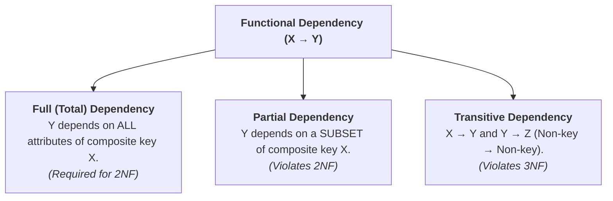
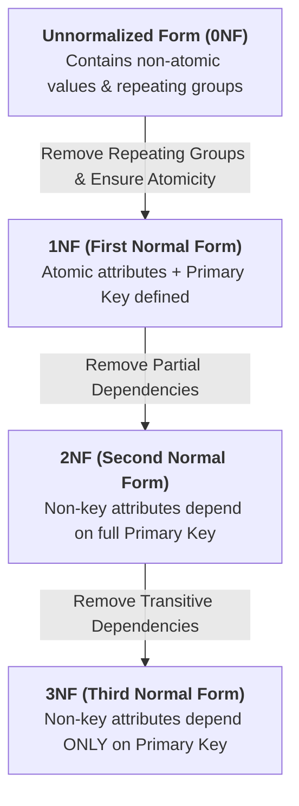
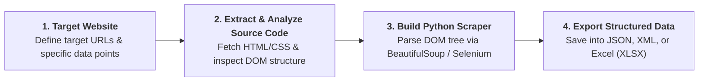

# Database Design, ERD Mapping, Normalization & Data Architecture Cheat Sheet

A comprehensive reference guide covering exact ERD-to-relational conversion rules, functional dependencies, normalization phases (1NF–3NF with full step-by-step example), NoSQL database paradigms, and API / web scraping architectures.

---

## 1. ERD to Relational Mapping Rules

Rules for transforming entities, attributes, and relationships from an ER Diagram into relational database tables, columns, and key constraints.

### A. Mapping Entities and Attributes

| ERD Element | Relational Schema Rule | Key Rule | Example |
| --- | --- | --- | --- |
| **Strong Entity** | Becomes a **standalone table**. | Primary Key (PK) stays the same. | `Customer` entity $\rightarrow$ `Customer` table. |
| **Simple Attribute** | Becomes a **regular column** in the table. | None. | `Salary` $\rightarrow$ `salary` column. |
| **Composite Attribute** | **Flattened**. Only its individual sub-parts become columns; the main parent attribute is omitted. | None. | `Name` (First, Last) $\rightarrow$ `first_name`, `last_name`. |
| **Multi-valued Attribute** | Becomes a **separate child table**. It is never kept in the main table. | PK is a composite of the Parent's PK + the attribute value. | `Skills` for an Employee $\rightarrow$ `Employee_Skills` table with `(EmpID, Skill)`. |
| **Derived Attribute** | **Omitted completely** from physical tables. | Calculated at runtime via queries. | `Age` is dropped (calculated from `DateOfBirth`). |
| **Weak Entity** | Becomes a **dependent table**. | PK is a composite key: Parent PK + Weak entity's partial key (discriminator). | `Dependent` table $\rightarrow$ `(EmpID, DependentName)`. |

---

### B. Mapping Unary (Recursive) Relationships

| Degree & Cardinality | Participation Constraints | Relational Mapping Rule & Strategy | Primary & Foreign Key Design | Practical Example |
| --- | --- | --- | --- | --- |
| **Unary 1:1** | **Both Sides Partial**   *(Optional - Optional)* | **Create a New Separate Table** to fully avoid `NULL` values. | Contains two columns pointing to the main table PK. One is the PK, the other is `UNIQUE`. | `Employee` *marries* `Employee`. A separate `Marriage` table stores `(HusbandEmpID [PK], WifeEmpID [UNIQUE])`. |
| **Unary 1:1** | **One Side Total, One Side Partial**   *(Mandatory - Optional)* | Add a single **Recursive FK** column directly to the entity table. | The recursive FK column must allow `NULL` values because a sequential chain must eventually start/end. | `Citizen` *is successor to* `Citizen` (Every leader has a predecessor [Total], but the current one has no successor yet [Partial]). |
| **Unary 1:1** | **Both Sides Total**   *(Mandatory - Mandatory)* | Add a single **Recursive FK** column directly to the entity table. | The recursive FK column is `NOT NULL` (enforced via deferred constraints in a circular loop). | A closed loop system where every single element *must* actively point to exactly one unique partner. |
| **Unary 1:N** | **Both Sides Partial**   *(Optional - Optional)* | **Create a New Separate Table** to fully avoid `NULL` values in the hierarchy. | Contains Parent PK and Child PK. The Child PK serves as the Primary Key of this new table. | `Employee` *manages* `Employee`. A separate `Management` table stores `(EmpID [PK], ManagerID)`. Employees without managers are simply left out. |
| **Unary 1:N** | **Many (N) Side Total, One (1) Side Partial**   *(Mandatory Parent)* | Add a single **Recursive FK** column directly to the entity table. | The recursive FK column must allow `NULL` for the root element, while all child elements point to a parent. | `Part` *is component of* `Part` (Every sub-assembly part belongs to a parent assembly, except the top-level final product which holds a `NULL` parent ID). |
| **Unary M:N** | **Any Participation**   *(Total or Partial)* | **Create a New Separate Table** (Junction Table). | Both columns are FKs pointing back to the main table PK. The PK is a **Composite Key** `(FK1, FK2)`. | `Course` *is prerequisite for* `Course` (A course can have many prerequisites, and be a prerequisite for many). |

---

### C. Mapping Binary Relationships

#### 1. Binary 1:1 (One-to-One) Permutations

| Degree & Cardinality | Participation Constraints | Relational Mapping Rule & Strategy | Where do the Keys Go? | Operational Reasoning |
| --- | --- | --- | --- | --- |
| **Binary 1:1** | **Both Sides Partial**   *(Optional - Optional)* | **Create a New Separate Table** (Relationship Table). | The table contains the PKs of both entities. One becomes the PK, the other is set to `UNIQUE`. | `User` $\leftrightarrow$ `Car`. To avoid filling main tables with `NULL` keys for users without cars (or cars without users), match them in a separate bridge table. |
| **Binary 1:1** | **Entity A: Total, Entity B: Partial**   *(Mandatory - Optional)* | **Foreign Key to the Total Side.** Place the FK directly inside the mandatory table. | Place Entity B's PK inside the **Entity A** table as an FK. The column is set to `NOT NULL` and `UNIQUE`. | `Employee` (Total) $\leftrightarrow$ `Desk` (Partial). Every employee *must* have a desk; a desk can sit empty. Putting `DeskID` in `Employee` guarantees zero null values. |
| **Binary 1:1** | **Both Sides Total**   *(Mandatory - Mandatory)* | **Merge into a Single Table.** Combine all attributes from both entities into one table. | No separate FK column is needed. Choose one unified Primary Key for the merged table. | `Order` (Total) $\leftrightarrow$ `Invoice` (Total). Neither can exist without the other; they represent a single synchronized real-world record. |

---

#### 2. Binary 1:N (One-to-Many) Permutations

| Degree & Cardinality | Participation Constraints | Relational Mapping Rule & Strategy | Where do the Keys Go? | Operational Reasoning |
| --- | --- | --- | --- | --- |
| **Binary 1:N** | **Both Sides Partial**   *(Optional - Optional)* | **Create a New Separate Table** (Relationship Table). | The table contains the PKs of both entities. The PK of the "Many" (N) side becomes the Primary Key of this new table. | `Customer` (1, Opt) $\leftrightarrow$ `Interaction` (N, Opt). Rather than putting a nullable `CustomerID` inside the `Interaction` table, a clean separate table matches them up. |
| **Binary 1:N** | **Many (N) Side: Total, One (1) Side: Partial** | **Foreign Key to the "Many" (N) Side.** | Put the PK of the "One" side into the table of the "Many" side as an FK. The column is strictly **`NOT NULL`**. | `Department` (1, Opt) $\leftrightarrow$ `Employee` (N, Tot). A department can have zero employees, but every employee must belong to a department. |
| **Binary 1:N** | **Many (N) Side: Partial, One (1) Side: Total** | **Foreign Key to the "Many" (N) Side (Nullable)** or separate table to eliminate `NULL` fields. | Put the PK of the "One" side into the table of the "Many" side as an FK. The column is **`NULLable`**. | `Account` (1, Tot) $\leftrightarrow$ `DiscountCode` (N, Opt). Since assigning an account to a discount code is optional, making the column nullable handles codes usable by anyone. |
| **Binary 1:N** | **Both Sides Total**   *(Mandatory - Mandatory)* | **Foreign Key to the "Many" (N) Side.** | Put the PK of the "One" side into the table of the "Many" side as an FK. The column is strictly **`NOT NULL`**. | `Order` (1, Tot) $\leftrightarrow$ `ItemLine` (N, Tot). An order must contain items, and an item line cannot exist without belonging to an order. |

---

#### 3. Binary M:N (Many-to-Many) Permutations

| Degree & Cardinality | Participation Constraints | Relational Mapping Rule & Strategy | Primary & Foreign Key Design | Operational Reasoning |
| --- | --- | --- | --- | --- |
| **Binary M:N** | **Any Combination**   *(Partial-Partial, Total-Partial, or Total-Total)* | **Create a New Separate Table** (Junction / Bridge Table). | The junction table inherits the PKs of both tables as Foreign Keys. The PK is a **Composite Key** `(FK_A, FK_B)`. | `Student` $\leftrightarrow$ `Course`. A student takes many courses; a course hosts many students. Structural constraints require a bridge table. |

---

## 2. Functional Dependency & Normalization Fundamentals

### Functional Dependency (FD) Core Concepts

* **Definition:** A Functional Dependency describes a constraint between two sets of attributes in a relation. An attribute set $X$ functionally determines an attribute set $Y$ (written as $X \rightarrow Y$) if and only if each value of $X$ is associated with **exactly one** value of $Y$.
* **Notation:** $X \rightarrow Y$
* $X$ is the **Determinant** (left-hand side).
* $Y$ is the **Dependent** (right-hand side).

---

### Types of Functional Dependencies

Functional dependencies dictate which normal form a database schema meets. Understanding the distinction between **Full (Total)**, **Partial**, and **Transitive** dependencies is essential for relational schema decomposition.

#### 1. Full (Total) Functional Dependency

* **Definition:** $Y$ is fully functionally dependent on $X$ if $X \rightarrow Y$, and $Y$ does **not** depend on any proper subset of $X$. In other words, every attribute in $X$ is strictly required to determine $Y$.
* **Formal Rule:** $X \rightarrow Y$, and for any attribute $A \in X$, $(X \setminus \{A\}) \not\rightarrow Y$.
* **Impact on Normalization:** Achieving **2NF** requires that **all** non-prime attributes have a Full Functional Dependency on the primary key.
* **Concrete Example:**
In a `Sales_Items` relation with composite primary key `(SaleID, Product)` and non-key attribute `Quantity`:

$$\text{(SaleID, Product)} \rightarrow \text{Quantity}$$

* `SaleID` alone cannot determine `Quantity`.
* `Product` alone cannot determine `Quantity`.
* Thus, `Quantity` is **Fully (Totally)** dependent on `(SaleID, Product)`.

---

#### 2. Partial Functional Dependency

* **Definition:** $Y$ is partially dependent on a composite key $X$ if $Y$ can be determined by a **proper subset** of $X$ alone.
* **Formal Rule:** Given composite candidate key $X$, $X \rightarrow Y$ is partial if there exists $A \subset X$ such that $A \rightarrow Y$.
* **Impact on Normalization:** **Violates 2NF**. Must be removed by extracting the proper subset $A$ and dependent $Y$ into a standalone table.
* **Concrete Example:**
In an un-normalized `Sales_Details` relation with composite primary key `(SaleID, Product)` and non-key attribute `ProductPrice`:

$$\text{(SaleID, Product)} \rightarrow \text{ProductPrice}$$

However:

$$\text{Product} \rightarrow \text{ProductPrice}$$

Because `Product` is a proper subset of `(SaleID, Product)`, `ProductPrice` has a **Partial Dependency** on the composite key.

---

#### 3. Transitive Functional Dependency

* **Definition:** A dependency where a non-prime attribute determines another non-prime attribute, creating an indirect chain of dependency from the primary key.
* **Formal Rule:** $X \rightarrow Y$ and $Y \rightarrow Z$, where $X$ is a candidate key, but $Y$ is **not** a candidate/super key and $Y \not\rightarrow X$. By transitivity, $X \rightarrow Z$.
* **Impact on Normalization:** **Violates 3NF**. Must be removed by separating $Y \rightarrow Z$ into its own table, leaving $Y$ as a foreign key in the original table.
* **Concrete Example:**
In a `Sales` table with primary key `SaleID` and attributes `CustomerID` and `CustomerPhone`:

$$\text{SaleID} \rightarrow \text{CustomerID}$$

$$\text{CustomerID} \rightarrow \text{CustomerPhone}$$

Therefore:

$$\text{SaleID} \rightarrow \text{CustomerPhone} \quad \text{(Transitive via CustomerID)}$$

Since `CustomerPhone` depends on non-key `CustomerID`, this is a **Transitive Dependency**.

---

### Comprehensive FD & Normalization Comparison Matrix

| Dependency Type | Key Constraint Condition | Formal Definition | Target Normal Form | Resolution / Action Required |
| --- | --- | --- | --- | --- |
| **Full (Total) Dependency** | $Y$ depends on **100% of attributes** in a composite key $X$. | $X \rightarrow Y \land \forall A \subset X, A \not\rightarrow Y$ | **2NF Goal** | **Keep in relation.** Represents correct table structure. |
| **Partial Dependency** | $Y$ depends on **a proper subset** of composite key $X$. | $X \rightarrow Y \land \exists A \subset X \text{ s.t. } A \rightarrow Y$ | **Violates 2NF** | **Decompose table.** Move subset $A$ and attribute $Y$ to a new table. |
| **Transitive Dependency** | Non-key $Y$ determines non-key $Z$ ($X \rightarrow Y \rightarrow Z$). | $X \rightarrow Y \land Y \rightarrow Z \quad (Y \text{ non-key})$ | **Violates 3NF** | **Decompose table.** Move $Y \rightarrow Z$ to a dedicated table; keep $Y$ as FK. |

---

### What is Normalization?

* **Definition:** Normalization is a systematic process in database design that organizes tables and attributes to reduce data redundancy and eliminate update, insertion, and deletion anomalies.
* **Phases:** It typically involves multiple progressive phases known as **Normal Forms (NF)**.

### Normal Form Summary Matrix

| Normal Form | Key Characteristics | Primary Objective | Dependency Removed |
| --- | --- | --- | --- |
| **1NF** *(First Normal Form)* | • Eliminates repeating groups.  • Ensures atomicity of columns (each column contains a single value).  • Identifies a primary key for each row. | To eliminate redundancy and ensure each column contains only atomic values. | Non-atomic attributes & multi-valued attributes. |
| **2NF** *(Second Normal Form)* | • Meets all 1NF requirements.  • Removes **partial dependencies**.  • Ensures non-key attributes are fully functionally dependent on the entire primary key. | To remove redundancy and ensure all non-key attributes are dependent only on the whole primary key. | **Partial Dependencies** *(Dependency on a sub-part of a composite PK)*. |
| **3NF** *(Third Normal Form)* | • Meets all 2NF requirements.  • Eliminates **transitive dependencies**.  • Ensures non-key attributes are not dependent on other non-key attributes. | To further reduce redundancy and ensure data integrity by removing indirect relationships between non-key attributes. | **Transitive Dependencies** *(Non-key attribute $\rightarrow$ Non-key attribute)*. |

---

## 3. Step-by-Step Normalization Example (0NF to 3NF)

### Unnormalized Form (0NF / ONF)

The initial unnormalized table contains non-atomic, comma-separated values in the `Product` column:

| SaleID | CustomerName | Phone | Product | Category | Price | Date |
| --- | --- | --- | --- | --- | --- | --- |
| 1 | Ahmed | 01012345678 | Laptop, Mouse | Computer | 1200 | 2025-06-01 |
| 2 | Sara | 01087654321 | Phone | Mobile | 900 | 2025-06-02 |
| 3 | Ahmed | 01012345678 | Laptop | Computer | 1200 | 2025-06-03 |

---

### Step 1: Conversion to 1NF (Atomicity & Splitting Tables)

1. Flatten comma-separated values so every record contains exactly **one atomic value** per column.
2. Identify composite primary keys and separate repeating order items from order header info.

#### `Sales Table (1NF)`

* **Primary Key:** `SaleID`

| SaleID | CustomerName | Phone | Date |
| --- | --- | --- | --- |
| 1 | Ahmed | 01012345678 | 2025-06-01 |
| 2 | Sara | 01087654321 | 2025-06-02 |
| 3 | Ahmed | 01012345678 | 2025-06-03 |

#### `Sales Details (1NF)`

* **Composite Primary Key:** `(SaleID, Product)`

| SaleID | Product | Category | Price |
| --- | --- | --- | --- |
| 1 | Laptop | Computer | 1200 |
| 1 | Mouse | Computer | 50 |
| 2 | Phone | Mobile | 900 |
| 3 | Laptop | Computer | 1200 |

---

### Step 2: Conversion to 2NF (Removing Partial Dependencies)

In `Sales Details (1NF)`, the composite key is `(SaleID, Product)`. However, `Category` and `Price` depend **only on `Product**`, not on `SaleID`. This is a **Partial Dependency**.

* **Action:** Extract `Product`, `Category`, and `Price` into a standalone `Products` table.

#### `Products Table (2NF)`

* **Primary Key:** `Product`

| Product | Category | Price |
| --- | --- | --- |
| Laptop | Computer | 1200 |
| Mouse | Computer | 50 |
| Phone | Mobile | 900 |

#### `Sales Details (2NF)`

* **Composite Primary Key:** `(SaleID, Product)`

| SaleID | Product |
| --- | --- |
| 1 | Laptop |
| 1 | Mouse |
| 2 | Phone |
| 3 | Laptop |

#### `Sales Table (2NF)`

* **Primary Key:** `SaleID`

| SaleID | CustomerName | Phone | Date |
| --- | --- | --- | --- |
| 1 | Ahmed | 01012345678 | 2025-06-01 |
| 2 | Sara | 01087654321 | 2025-06-02 |
| 3 | Ahmed | 01012345678 | 2025-06-03 |

---

### Step 3: Conversion to 3NF (Removing Transitive Dependencies)

In `Sales Table (2NF)`, `SaleID` determines `CustomerName` and `Phone`. However, `CustomerName` and `Phone` are non-key attributes describing a **Customer** entity, creating an indirect/transitive dependency (`SaleID` $\rightarrow$ `Customer` $\rightarrow$ `Phone`).

* **Action:** Extract `Customer` information into a dedicated `Customers` table with `CustomerID` as Primary Key, and place `CustomerID` as a Foreign Key inside `Sales`.

#### `Customers Table (3NF)`

* **Primary Key:** `CustomerID`

| CustomerID | CustomerName | Phone |
| --- | --- | --- |
| C001 | Ahmed | 01012345678 |
| C002 | Sara | 01087654321 |

#### `Sales Table (3NF)`

* **Primary Key:** `SaleID` | **Foreign Key:** `CustomerID`

| SaleID | CustomerID | Date |
| --- | --- | --- |
| 1 | C001 | 2025-06-01 |
| 2 | C002 | 2025-06-02 |
| 3 | C001 | 2025-06-03 |

#### `Products Table (3NF)`

* **Primary Key:** `Product`

| Product | Category | Price |
| --- | --- | --- |
| Laptop | Computer | 1200 |
| Mouse | Computer | 50 |
| Phone | Mobile | 900 |

#### `Sales Details (3NF)`

* **Composite Primary Key:** `(SaleID, Product)`

| SaleID | Product |
| --- | --- |
| 1 | Laptop |
| 1 | Mouse |
| 2 | Phone |
| 3 | Laptop |

---

## 4. Non-Relational (NoSQL) Databases

Non-Relational databases provide flexible schemas designed for high-scalability, real-time analytics, and unstructured or semi-structured data storage.

| Database System | NoSQL Type | Internal Representation & Architecture | Primary Use Cases |
| --- | --- | --- | --- |
| **MongoDB**  | **Document-oriented**  | Stores data as JSON-like documents (BSON) grouped in collections. | Content Management Systems (CMS), real-time analytics, mobile applications. |
| **Cassandra**  | **Wide-column store**  | Tables with dynamic, flexible column schemas partitioned across nodes. | High-availability applications, real-time big data, IoT applications. |
| **Redis**  | **Key-value store**  | In-memory key-value pairs optimized for sub-millisecond lookups. | Caching layers, session management, real-time leaderboards/analytics. |
| **Neo4j**  | **Graph database**  | Graph structures composed of Nodes, Relationships (edges), and Properties. | Social networks, fraud detection networks, recommendation engines. |

---

## 5. APIs & Web Scraping

### A. Application Programming Interfaces (APIs)

* **Definition:** An API (Application Programming Interface) is a set of formal rules and protocols for building and interacting with software applications. It defines the exact request methods, parameters, and data exchange formats used for inter-application communication.

#### Key Categories of APIs

1. **Web APIs:**
    * **REST (Representational State Transfer):** Lightweight, stateless, standard HTTP methods (GET, POST, PUT, DELETE) utilizing JSON or XML formats.
    * **SOAP (Simple Object Access Protocol):** Highly structured, XML-based protocol with strict built-in security and transactional compliance.

2. **Library-Based APIs:**
    * Standard library interfaces, function routines, and object classes built into programming languages like Python, C++, or Java.

3. **Real-World Web API Examples:**
    * **Twitter API:** Retrieve posts, user profiles, and engagement analytics.
    * **Google Maps API:** Embed interactive mapping, geocoding, and routing services.

---

### B. Web Scraping with Python

When structured API endpoints are unavailable, **Web Scraping** extracts structured data directly from web pages.

#### Step-by-Step Python Scraping Workflow

1. **Target Identification:** Define the target URL and specify required data attributes.
2. **Source Code Extraction:** Request the web page and analyze its HTML DOM hierarchy.
3. **Scraper Implementation:** Write Python scripts using parsing libraries to target specific HTML tags and attributes.
4. **Data Export:** Parse and serialize collected unstructured data into structured outputs such as **JSON**, **XML**, or **Excel (`.xlsx`)** spreadsheets.