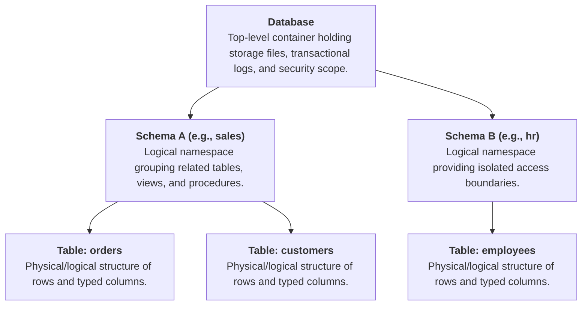

# SQL Architecture, Query Execution & Aggregate Functions Cheat Sheet

A comprehensive reference guide covering the relational hierarchy (Database vs. Schema vs. Table), logical SQL query execution order, clause syntax and behavior, and aggregate functions with exact `NULL` handling rules.

---

## 1. Database Structural Hierarchy: Database vs. Schema vs. Table

Understanding the organizational hierarchy is essential for object qualification, access control, and multi-tenant data architecture.



### Architectural Comparison Matrix

| Concept | Scope & Definition | Primary Purpose | Fully Qualified Name (FQN) Syntax | Analogy |
| --- | --- | --- | --- | --- |
| **Database** | The outermost physical and logical container managed by a Database Management System (DBMS). Holds configuration, transactional logs, and schemas. | Security isolation, disaster recovery unit, backup/restore boundary. | `DatabaseName` | **The Entire Building** |
| **Schema** | A logical partition or namespace inside a database that groups related objects (tables, views, indexes, stored procedures). | Access control, namespace isolation, preventing naming collisions across modules. | `DatabaseName.SchemaName` | **An Individual Floor / Department** |
| **Table** | A structured data object composed of fixed columns (attributes with declared data types) and dynamic rows (records). | Storing actual relational data instances and enforcing constraints (PK, FK, CHECK). | `DatabaseName.SchemaName.TableName` | **A Filing Cabinet on that Floor** |

---

## 2. SQL Logical Execution Order & Core Clauses

While SQL queries are **written** starting with `SELECT`, the database engine **evaluates** clauses in a completely different sequence. Understanding logical processing order is critical for writing valid queries and avoiding scope errors (e.g., referencing column aliases in `WHERE` clauses).

### Logical Query Processing Flow

```mermaid
flowchart LR
    Step1["<b>1. FROM</b><br/>Identify source tables & apply joins"] --> Step2["<b>2. WHERE</b><br/>Filter raw rows before aggregation"]
    Step2 --> Step3["<b>3. GROUP BY</b><br/>Group rows into summary buckets"]
    Step3 --> Step4["<b>4. HAVING</b><br/>Filter aggregated group buckets"]
    Step4 --> Step5["<b>5. SELECT</b><br/>Evaluate expressions & column aliases"]
    Step5 --> Step6["<b>6. DISTINCT</b><br/>Deduplicate remaining output rows"]
    Step6 --> Step7["<b>7. ORDER BY</b><br/>Sort final output set"]
    Step7 --> Step8["<b>8. TOP / LIMIT</b><br/>Restrict final row count output"]
```



---

### Core Clauses Reference

| Clause | Logical Order | Core Function | Valid Expression Constraints | Operational Example |
| --- | --- | --- | --- | --- |
| **`FROM`** | **1** | Specifies the source table(s) to read and establishes join logic. | Defines table references and aliases. | `FROM sales.orders AS o` |
| **`WHERE`** | **2** | Filters individual rows **before** any grouping or aggregation occurs. | **Cannot** contain aggregate functions (e.g., `WHERE SUM(price) > 100` is invalid). | `WHERE o.status = 'COMPLETED'` |
| **`GROUP BY`** | **3** | Collapses multiple rows sharing identical values in specified columns into aggregate summary rows. | Every non-aggregated column in `SELECT` **must** be listed in `GROUP BY`. | `GROUP BY o.region, o.category` |
| **`HAVING`** | **4** | Filters group buckets **after** aggregation has taken place. | Can reference aggregate functions directly (e.g., `HAVING COUNT(*) > 5`). | `HAVING SUM(o.total) >= 1000` |
| **`SELECT`** | **5** | Computes output expressions, projects specified columns, and assigns column aliases. | Aliases created here are **not accessible** in `WHERE` or `GROUP BY`. | `SELECT o.region, SUM(o.total) AS sales` |
| **`DISTINCT`** | **6** | Eliminates duplicate rows across all projected columns in the result set. | Evaluated after expressions in `SELECT` are evaluated. | `SELECT DISTINCT o.customer_id` |
| **`ORDER BY`** | **7** | Sorts the final result set by one or more columns or expressions (`ASC` or `DESC`). | **Can** reference column aliases created in the `SELECT` phase. | `ORDER BY sales DESC, o.region ASC` |
| **`TOP` / `LIMIT`** | **8** | Truncates the result set to return only a specified maximum number or percentage of rows. | Applied as the absolute final operation on the sorted set. | SQL Server: `SELECT TOP 10`<br>PostgreSQL/MySQL: `LIMIT 10` |

---

### Key Operators & Modifiers (`BETWEEN`, `DISTINCT`, `TOP` / `LIMIT`)

#### 1. `BETWEEN` Operator

* **Definition:** Range operator used in `WHERE` or `HAVING` clauses to filter values within an inclusive range.
* **Inclusive Nature:** Equivalent to `expression >= low AND expression <= high`.
* **Syntax:** `column BETWEEN low_value AND high_value`
* **Edge Case (`NULL` handling):** If `column`, `low_value`, or `high_value` is `NULL`, the expression evaluates to `UNKNOWN` and excludes the row.

```sql
-- Inclusive range filter for dates
WHERE order_date BETWEEN '2026-01-01' AND '2026-06-30'
```

#### 2. `DISTINCT` Modifier

* **Definition:** Removes identical duplicate rows from the query output.
* **Scope:** Applies to the **entire row context** defined in the `SELECT` clause, not just a single column.
* **Syntax:** `SELECT DISTINCT column1, column2 FROM schema.table`
* **`NULL` Behavior:** Treats all `NULL` values as identical duplicates and groups them into a single `NULL` output row.

#### 3. `TOP` vs `LIMIT` (Dialect Dialectics)

* **Definition:** Constrains the total number of records returned to the client.

| Feature | `TOP (N)` Syntax | `LIMIT N` Syntax |
| --- | --- | --- |
| **Primary DBMS** | T-SQL (Microsoft SQL Server) | PostgreSQL, MySQL, SQLite, DuckDB |
| **Placement in SQL** | Placed inside `SELECT` (e.g., `SELECT TOP 5 ...`) | Placed at the very end of the query (e.g., `... LIMIT 5`) |
| **Tie Handling** | Supports `TOP N WITH TIES` (requires `ORDER BY`). | Requires `FETCH FIRST N ROWS WITH TIES` (ANSI SQL standard). |

---

## 3. SQL Aggregate Functions

Aggregate functions perform a calculation on a set of values and return a single scalar summary value. Except for `COUNT(*)`, all aggregate functions **ignore `NULL` values**.

### Aggregate Function Matrix

| Function | Output Data Type | Supported Data Types | `NULL` Handling Behavior | Primary Use Case | Example Usage |
| --- | --- | --- | --- | --- | --- |
| **`COUNT`** | Integer | All types | **`COUNT(*)`:** Counts all rows.<br> **`COUNT(col)`:** Ignores `NULL` values. | Counting total records or populated attributes. | `COUNT(order_id)` |
| **`SUM`** | Numeric / Decimal / Integer | Numeric types only | Ignores `NULL`s completely. Returns `NULL` if all inputs are `NULL`. | Calculating running or total totals. | `SUM(order_amount)` |
| **`AVG`** | Floating-point / Numeric | Numeric types only | Ignores `NULL`s. Evaluates as $\frac{\text{SUM(non-null)}}{\text{COUNT(non-null)}}$. | Calculating arithmetic mean. | `AVG(unit_price)` |
| **`MIN`** | Matches Input Type | Numeric, String, Date/Time | Ignores `NULL`s. Evaluates alphabetic, chronological, or numeric minimum. | Finding earliest date, lowest price, or first alphabetically. | `MIN(order_date)` |
| **`MAX`** | Matches Input Type | Numeric, String, Date/Time | Ignores `NULL`s. Evaluates alphabetic, chronological, or numeric maximum. | Finding latest date, peak revenue, or last alphabetically. | `MAX(salary)` |

---

### Critical Nuances: `COUNT(*)` vs `COUNT(column)` vs `COUNT(DISTINCT column)`

Given a sample dataset `orders`:

| order_id | customer_id | discount_code |
| --- | --- | --- |
| 101 | C1 | `NULL` |
| 102 | C1 | `SUMMER20` |
| 103 | C2 | `SUMMER20` |
| 104 | `NULL` | `NULL` |

```sql
SELECT 
    COUNT(*) AS total_rows,                    -- Result: 4 (Counts all physical rows)
    COUNT(customer_id) AS total_customers,     -- Result: 3 (Ignores NULL in row 104)
    COUNT(discount_code) AS total_discounts,   -- Result: 2 (Ignores NULLs in rows 101, 104)
    COUNT(DISTINCT customer_id) AS unique_cust -- Result: 2 (Evaluates distinct non-null values: 'C1', 'C2')
FROM sales.orders;
```

---

## 4. End-to-End Comprehensive SQL Walkthrough

An annotated, multi-clause query demonstrating exact logical execution flow combining all clauses, range filtering, aggregate calculations, and grouping constraints.

### Source Data: `sales.order_items`

| item_id | store_id | category | status | unit_price | quantity |
| --- | --- | --- | --- | --- | --- |
| 1 | S01 | Electronics | COMPLETED | 500.00 | 2 |
| 2 | S01 | Electronics | COMPLETED | 150.00 | 1 |
| 3 | S01 | Apparel | COMPLETED | 40.00 | 5 |
| 4 | S01 | Electronics | CANCELLED | 1000.00 | 1 |
| 5 | S02 | Electronics | COMPLETED | 300.00 | 3 |
| 6 | S02 | Apparel | COMPLETED | 50.00 | 2 |
| 7 | S02 | Electronics | COMPLETED | 800.00 | 1 |

---

### SQL Query Execution Demonstration

```sql
SELECT TOP 2
    store_id,
    category,
    COUNT(item_id) AS items_sold,
    SUM(unit_price * quantity) AS total_revenue,
    AVG(unit_price) AS avg_unit_price
FROM sales.order_items
WHERE status = 'COMPLETED' 
  AND unit_price BETWEEN 40.00 AND 900.00
GROUP BY store_id, category
HAVING SUM(unit_price * quantity) >= 500.00
ORDER BY total_revenue DESC;
```

---

### Step-by-Step Logical Engine Execution

1. **`FROM sales.order_items`**: Loads source table containing 7 total records.
2. **`WHERE status = 'COMPLETED' AND unit_price BETWEEN 40.00 AND 900.00`**:
    * Filters out `CANCELLED` status (removes row 4).
    * Filters out `unit_price` outside inclusive range $[40.00, 900.00]$ (all remaining rows 1, 2, 3, 5, 6, 7 pass).

3. **`GROUP BY store_id, category`**: Collapses remaining rows into unique composite groups:
    * Group A: `(S01, Electronics)` $\rightarrow$ Rows 1, 2
    * Group B: `(S01, Apparel)` $\rightarrow$ Row 3
    * Group C: `(S02, Electronics)` $\rightarrow$ Rows 5, 7
    * Group D: `(S02, Apparel)` $\rightarrow$ Row 6

4. **`HAVING SUM(unit_price * quantity) >= 500.00`**:
    * Group A revenue: $(500\times2) + (150\times1) = 1150.00$ ($\ge 500$, **Kept**)
    * Group B revenue: $40\times5 = 200.00$ ($< 500$, **Discarded**)
    * Group C revenue: $(300\times3) + (800\times1) = 1700.00$ ($\ge 500$, **Kept**)
    * Group D revenue: $50\times2 = 100.00$ ($< 500$, **Discarded**)

5. **`SELECT`**: Evaluates expressions and projects columns for remaining Groups A and C:
    * Group C: `items_sold` = 2, `total_revenue` = 1700.00, `avg_unit_price` = 550.00
    * Group A: `items_sold` = 2, `total_revenue` = 1150.00, `avg_unit_price` = 325.00

6. **`ORDER BY total_revenue DESC`**: Sorts group outputs descending:
    * Row 1: Group C (`total_revenue` = 1700.00)
    * Row 2: Group A (`total_revenue` = 1150.00)

7. **`TOP 2`**: Restricts output to the top 2 sorted records.

---

### Final Output Result Set

| store_id | category | items_sold | total_revenue | avg_unit_price |
| --- | --- | --- | --- | --- |
| S02 | Electronics | 2 | 1700.00 | 550.00 |
| S01 | Electronics | 2 | 1150.00 | 325.00 |