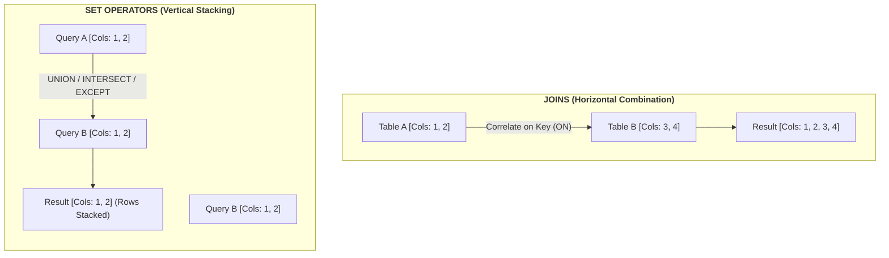

# SQL Operators, Joins & Set Operations Cheat Sheet

A technical reference guide covering SQL operator evaluation rules, `NULL` handling, search pattern syntax, structural differences between Joins and Sets, and comprehensive relational Join mechanics.

---

## 1. SQL Operators & Expression Evaluation

SQL operators evaluate expressions to return Boolean results (`TRUE`, `FALSE`, or `UNKNOWN`). Because SQL supports `NULL` (representing missing/unknown data), operator evaluation requires specific `NULL` resolution rules.

### Comparison & Range Operators

| Operator | Type | Behavior & Syntax | `NULL` Handling Rules | Example |
| --- | --- | --- | --- | --- |
| `=` | Comparison | Tests strict equality. | Returns `UNKNOWN` if either side is `NULL`. | `Region = 'EMEA'` |
| `<>`, `!=` | Comparison | Tests inequality. | Returns `UNKNOWN` if either side is `NULL`. | `Status <> 'CANCELLED'` |
| `>`, `<`, `>=`, `<=` | Comparison | Numeric, chronological, or alphabetic bound comparison. | Returns `UNKNOWN` if either side is `NULL`. | `UnitPrice >= 50.00` |
| `IS NULL` / `IS NOT NULL` | Comparison | Tests for presence/absence of a `NULL` state. | Evaluates explicitly to `TRUE` or `FALSE`. | `DiscountCode IS NOT NULL` |
| `BETWEEN ... AND ...` | Range | Inclusive bound check: $Low \le x \le High$. | Returns `UNKNOWN` if operand or bounds are `NULL`. | `OrderDate BETWEEN '2026-01-01' AND '2026-03-31'` |

#### SQL Example: Comparison & Range Operators

```sql
SELECT 
    EmployeeId,
    Salary,
    CommissionRate
FROM HR.Employees
WHERE Salary BETWEEN 50000.00 AND 120000.00
    AND CommissionRate IS NOT NULL
    AND DepartmentId <> 5;
```

---

### Logical Operators & Boolean Evaluation

Logical operators combine Boolean input expressions. When `NULL` values are present, truth tables resolve as follows:

| Expression A | Expression B | `A AND B` | `A OR B` | `NOT A` |
| --- | --- | --- | --- | --- |
| `TRUE` | `TRUE` | `TRUE` | `TRUE` | `FALSE` |
| `TRUE` | `FALSE` | `FALSE` | `TRUE` | `FALSE` |
| `TRUE` | `UNKNOWN` | `UNKNOWN` | `TRUE` | `FALSE` |
| `FALSE` | `UNKNOWN` | `FALSE` | `UNKNOWN` | `TRUE` |
| `UNKNOWN` | `UNKNOWN` | `UNKNOWN` | `UNKNOWN` | `UNKNOWN` |

> **Critical Rule:** In `WHERE` and `HAVING` clauses, only rows where the overall expression evaluates strictly to **`TRUE`** are passed through. Rows evaluating to `FALSE` or `UNKNOWN` are discarded.

#### SQL Example: Logical Operators & NULL Filtering

```sql
SELECT OrderId, CustomerId, TotalAmount, Status
FROM Sales.Orders
-- True AND True resolves to True; rows evaluating to UNKNOWN or FALSE are filtered out
WHERE (Status = 'COMPLETED' AND TotalAmount >= 100.00)
    OR (NOT (Status = 'CANCELLED') AND CustomerId IS NOT NULL);
```

---

### Membership & Search Operators

| Operator | Category | Functionality | Key Nuances & `NULL` Pitfalls |
| --- | --- | --- | --- |
| **`IN (...)`** | Membership | Evaluates if a value matches any item in a literal list or single-column subquery. | Equivalent to chained `OR` checks (`x = 1 OR x = 2`). Returns `TRUE` if matched, even if list contains `NULL`. |
| **`NOT IN (...)`** | Membership | Evaluates if a value matches no items in a list/subquery. | **The `NULL` Trap:** Expanded as `x != 1 AND x != 2 AND x != NULL`. If the list contains a `NULL`, `NOT IN` yields `UNKNOWN` for all non-matching rows, returning **zero results**. |
| **`LIKE`** | Search | Pattern matching using wildcards (`%` = 0+ chars, `_` = 1 char). | Case sensitivity depends on collation. Requires `ESCAPE` clause to search literal `%` or `_`. |
| **`ILIKE`** | Search | Case-insensitive pattern matching. | PostgreSQL / DuckDB specific (ANSI standard equivalent is `LIKE` with `LOWER()`). |
| **`EXISTS`** | Search | Returns `TRUE` if a subquery produces at least one row. | **Correlated Subquery Optimization:** Evaluates row-by-row existence; ignores subquery `SELECT` projection (e.g., `WHERE EXISTS (SELECT 1 ...)`). Immune to `NULL` column pitfalls. |

#### SQL Example: Membership, Pattern Search & NULL Safety

```sql
-- 1. IN & LIKE Search Query
SELECT ProductId, ProductName, SKU
FROM Inventory.Products
WHERE CategoryId IN (1, 3, 7)                     -- Membership check
    AND SKU LIKE 'ELEC-%'                           -- Starts with 'ELEC-'
    AND LOWER(ProductName) LIKE '%pro%';            -- Standard case-insensitive pattern matching

-- 2. Dangerous NOT IN (The NULL Trap) vs. Safe EXISTS Alternative
-- DANGEROUS: Returns 0 rows if ANY SupplierId in Procurement.Suppliers is NULL
SELECT ProductId, ProductName 
FROM Inventory.Products
WHERE SupplierId NOT IN (SELECT SupplierId FROM Procurement.Suppliers);

-- SAFE: Handles NULLs correctly and optimizes execution via semi-join
SELECT p.ProductId, p.ProductName
FROM Inventory.Products AS p
WHERE NOT EXISTS (
    SELECT 1 
    FROM Procurement.Suppliers AS s 
    WHERE s.SupplierId = p.SupplierId
);
```

---

## 2. Fundamental Architecture: Joins vs. Set Operators

Relational engines combine datasets through two orthogonal operations: **Horizontal Combination (Joins)** and **Vertical Combination (Sets)**.



### Architectural Comparison Matrix

| Dimensional Attribute | Relational Joins (`INNER`, `LEFT`, `FULL`, etc.) | Set Operators (`UNION`, `INTERSECT`, `EXCEPT`) |
| --- | --- | --- |
| **Direction of Combination** | **Horizontal** (Combines columns side-by-side). | **Vertical** (Stacks rows on top of each other). |
| **Schema Constraints** | Source tables can have completely different structures, column names, and data types. | Output schemas **must** be set-compatible (same number of columns, implicitly convertible data types in order). |
| **Correlation Mechanism** | Requires explicit join predicate (`ON A.Key = B.Key`). | Evaluates entire tuple equality across projected columns (no `ON` clause). |
| **Width vs. Height Impact** | Multiplies width (increases total attributes). Row count varies ($0$ to $N \times M$). | Maintains fixed column count. Alters dataset height (row count). |
| **Duplicate Elimination** | Retains duplicates generated by $1:M$ or $M:N$ key matches. | Default operations (`UNION`, `INTERSECT`, `EXCEPT`) execute distinct deduplication across all columns. `ALL` variants (e.g., `UNION ALL`) preserve duplicates. |

#### SQL Example: Join (Horizontal) vs. Set (Vertical) Side-by-Side

```sql
-- 1. RELATIONAL JOIN (Horizontal: Expands Width from 2 columns to 4 columns)
SELECT 
    e.EmployeeId, 
    e.EmployeeName, 
    d.DepartmentId, 
    d.DepartmentName
FROM HR.Employees AS e
INNER JOIN HR.Departments AS d 
    ON e.DepartmentId = d.DepartmentId;

-- 2. SET OPERATION (Vertical: Keeps fixed 3-column schema, Stacks Rows)
SELECT FirstName, LastName, Email FROM HR.Employees
UNION ALL
SELECT FirstName, LastName, Email FROM Sales.Customers;
```

---

## 3. Relational Join Types (Excluding Self Join)

Joins correlate records between two relations ($L$ and $R$) based on a logical predicate.

### Join Classification Matrix

| Join Type | ANSI Syntax | Retained Unmatched Rows | Output Row Count Range | Primary Use Case |
| --- | --- | --- | --- | --- |
| **Inner Join** | `INNER JOIN` | None (Requires match in both tables). | $0 \le N \le (L \times R)$ | Fetching strictly correlated relationships (e.g., Orders with valid Customers). |
| **Left Outer Join** | `LEFT JOIN` | All unmatched rows from **Left** table. | $L \le N \le (L \times R)$ | Preserving parent entities regardless of child record presence (e.g., All Customers + optional Orders). |
| **Right Outer Join** | `RIGHT JOIN` | All unmatched rows from **Right** table. | $R \le N \le (L \times R)$ | Preserving child/target entities; functionally identical to inverted `LEFT JOIN`. |
| **Full Outer Join** | `FULL JOIN` | All unmatched rows from **Both** tables. | $\max(L,R) \le N \le (L + R)$ or $(L \times R)$ | Auditing discrepancies, reconciling data across disparate pipelines. |
| **Cross Join** | `CROSS JOIN` | N/A (Produces Cartesian Product). | Exactly $L \times R$ | Generating matrix combinations, grid reports, or benchmark test data. |

---

### Detailed Operational Syntax & Behavior

#### 1. `INNER JOIN`

Returns rows where the relational predicate evaluates to `TRUE`. Unmatched records from both relations are discarded.

```sql
SELECT c.CustomerId, c.CustomerName, o.OrderId, o.TotalAmount
FROM Sales.Customers AS c
INNER JOIN Sales.Orders AS o 
    ON c.CustomerId = o.CustomerId;
```

#### 2. `LEFT (OUTER) JOIN`

Returns all rows from the left table ($L$). If a match is found in the right table ($R$), attributes are populated; otherwise, right attributes are padded with `NULL`.

```sql
SELECT c.CustomerId, c.CustomerName, o.OrderId
FROM Sales.Customers AS c
LEFT JOIN Sales.Orders AS o 
    ON c.CustomerId = o.CustomerId;
```

#### 3. `RIGHT (OUTER) JOIN`

Returns all rows from the right table ($R$). Unmatched left table attributes are padded with `NULL`.

```sql
SELECT o.OrderId, o.TotalAmount, p.PaymentStatus
FROM Sales.Orders AS o
RIGHT JOIN Sales.Payments AS p 
    ON o.OrderId = p.OrderId;
```

#### 4. `FULL (OUTER) JOIN`

Combines results of `LEFT JOIN` and `RIGHT JOIN`. Unmatched attributes from either side are padded with `NULL`.

```sql
SELECT c.CustomerId, c.CustomerName, b.BillingAccountId
FROM Sales.Customers AS c
FULL JOIN Billing.Accounts AS b 
    ON c.CustomerId = b.CustomerId;
```

#### 5. `CROSS JOIN`

Evaluates every combination of rows from the left relation against every row of the right relation ($L \times R$). Takes no `ON` predicate clause.

```sql
SELECT p.ProductName, s.StoreRegion
FROM Inventory.Products AS p
CROSS JOIN Location.Stores AS s;
```

---

## 4. End-to-End Walkthrough: Complex Multi-Table Query

An annotated execution demonstrating filtering logic, operators, `NULL` handling, relational joins, and set mechanics.

### Source Datasets

#### `Sales.Customers` ($L$)

| CustomerId | CustomerName | Region | Tier |
| --- | --- | --- | --- |
| 1 | Alice | North | Gold |
| 2 | Bob | South | Silver |
| 3 | Charlie | North | `NULL` |
| 4 | David | West | Bronze |

#### `Sales.Orders` ($R$)

| OrderId | CustomerId | Amount | Status |
| --- | --- | --- | --- |
| 101 | 1 | 450.00 | COMPLETED |
| 102 | 1 | 150.00 | COMPLETED |
| 103 | 2 | 80.00 | PENDING |
| 104 | `NULL` | 500.00 | COMPLETED |

---

### Executed SQL Query

```sql
SELECT 
    c.CustomerId,
    c.CustomerName,
    c.Region,
    COALESCE(c.Tier, 'Standard') AS CustomerTier,
    o.OrderId,
    o.Amount
FROM Sales.Customers AS c
LEFT JOIN Sales.Orders AS o 
    ON c.CustomerId = o.CustomerId 
    AND o.Status = 'COMPLETED'
WHERE (c.Region IN ('North', 'South') OR c.Tier IS NULL)
    AND (o.Amount IS NULL OR o.Amount BETWEEN 100.00 AND 1000.00)
ORDER BY c.CustomerId ASC, o.OrderId DESC;
```

---

### Step-by-Step Logical Engine Execution

1. **`FROM Sales.Customers AS c LEFT JOIN Sales.Orders AS o ON ... AND o.Status = 'COMPLETED'`**
    * Correlates Customers ($L$) and Orders ($R$) on `CustomerId` matching, preserving un-matched Customers.
    * Applying `o.Status = 'COMPLETED'` in the `ON` clause filters right-side attributes **before** left preservation. Order `103` (`PENDING`) fails the predicate, turning Customer `2`'s order match into `NULL`.
    * *Intermediate State:*
    * `(1, Alice, North, Gold) -> Order 101 (450.00)`
    * `(1, Alice, North, Gold) -> Order 102 (150.00)`
    * `(2, Bob, South, Silver) -> NULL`
    * `(3, Charlie, North, NULL) -> NULL`
    * `(4, David, West, Bronze) -> NULL`

2. **`WHERE (c.Region IN ('North', 'South') OR c.Tier IS NULL)`**
    * Evaluates predicate on physical rows:
    * Alice (`North`): `TRUE` $\rightarrow$ Kept.
    * Bob (`South`): `TRUE` $\rightarrow$ Kept.
    * Charlie (`North`, `Tier IS NULL`): `TRUE` $\rightarrow$ Kept.
    * David (`West`, `Bronze`): `FALSE` $\rightarrow$ Discarded.

3. **`AND (o.Amount IS NULL OR o.Amount BETWEEN 100.00 AND 1000.00)`**
    * Evaluates order amount constraints:
    * Alice Order 101 ($450.00$): `BETWEEN 100 AND 1000` $\rightarrow$ `TRUE`.
    * Alice Order 102 ($150.00$): `BETWEEN 100 AND 1000` $\rightarrow$ `TRUE`.
    * Bob Order (`NULL`): `o.Amount IS NULL` $\rightarrow$ `TRUE`.
    * Charlie Order (`NULL`): `o.Amount IS NULL` $\rightarrow$ `TRUE`.

4. **`SELECT Projection & COALESCE Expression`**
    * Converts `NULL` Tiers to string literal `'Standard'`.

5. **`ORDER BY c.CustomerId ASC, o.OrderId DESC`**
    * Sorts intermediate records sequentially by Customer ID ascending, breaking ties with Order ID descending.

---

### Final Output Result Set

| CustomerId | CustomerName | Region | CustomerTier | OrderId | Amount |
| --- | --- | --- | --- | --- | --- |
| 1 | Alice | North | Gold | 102 | 150.00 |
| 1 | Alice | North | Gold | 101 | 450.00 |
| 2 | Bob | South | Silver | `NULL` | `NULL` |
| 3 | Charlie | North | Standard | `NULL` | `NULL` |