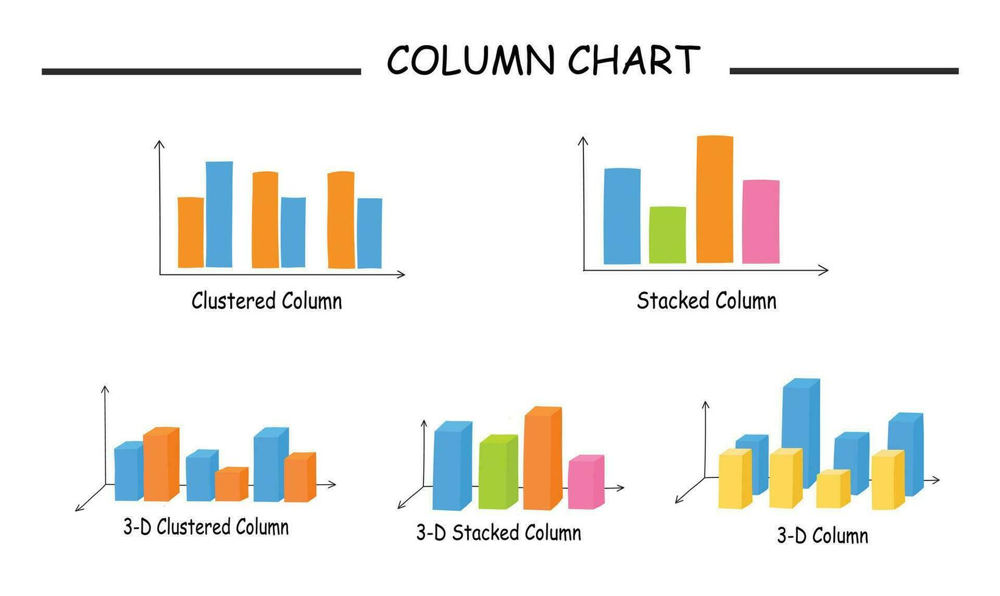
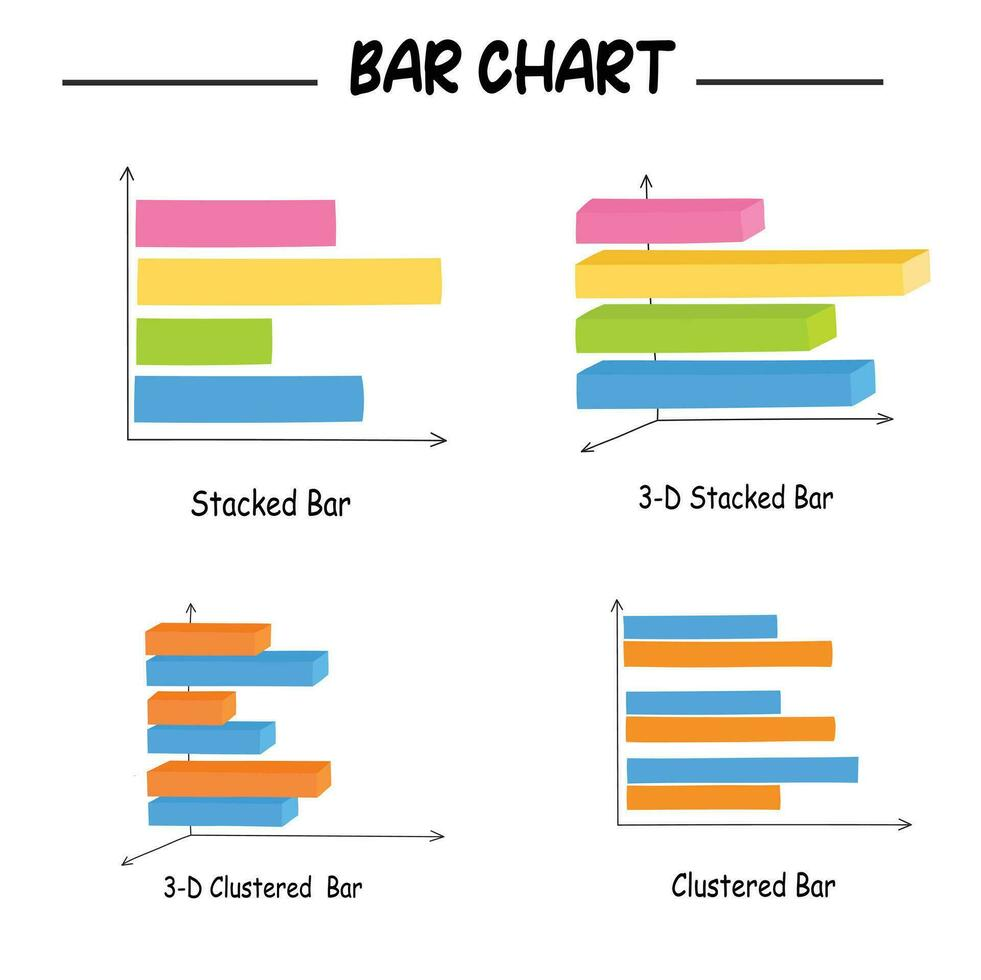
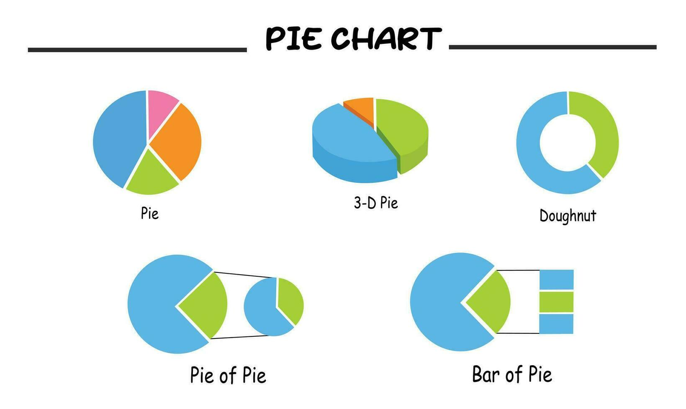
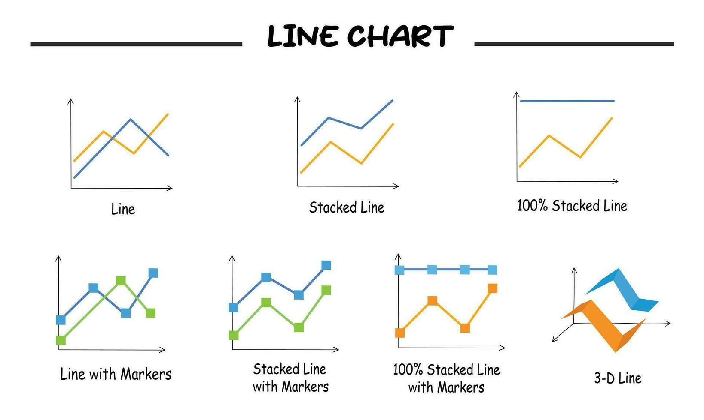
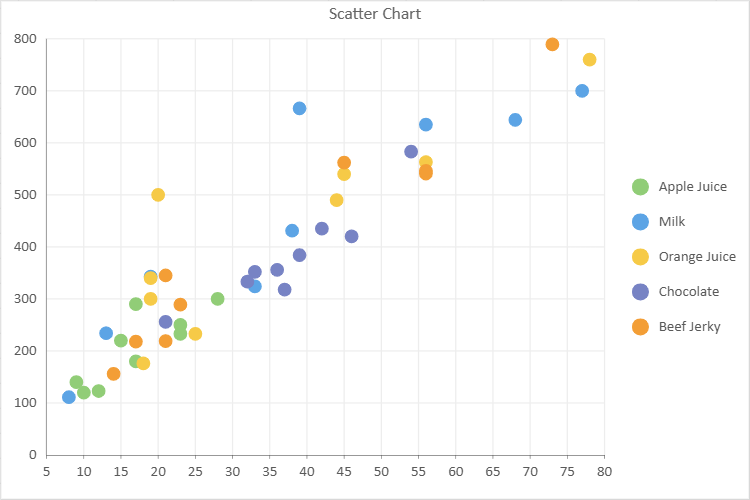
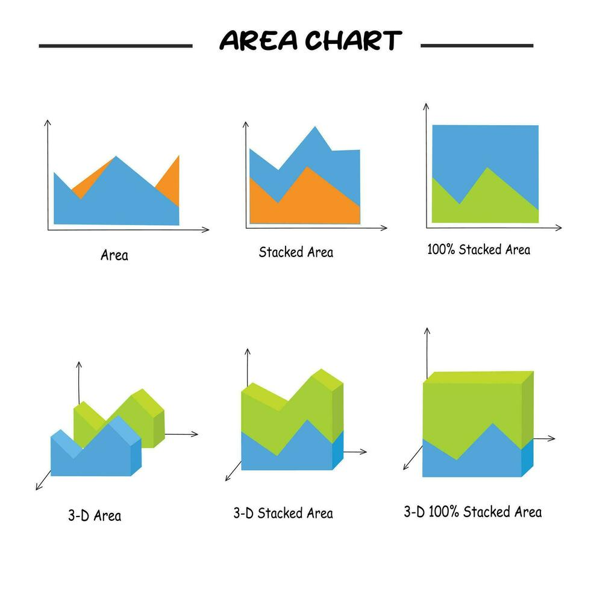
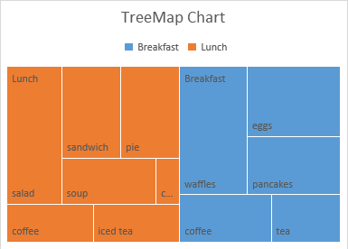
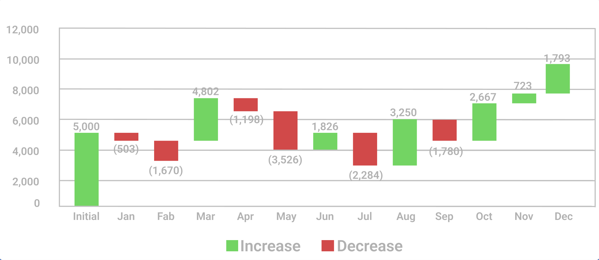
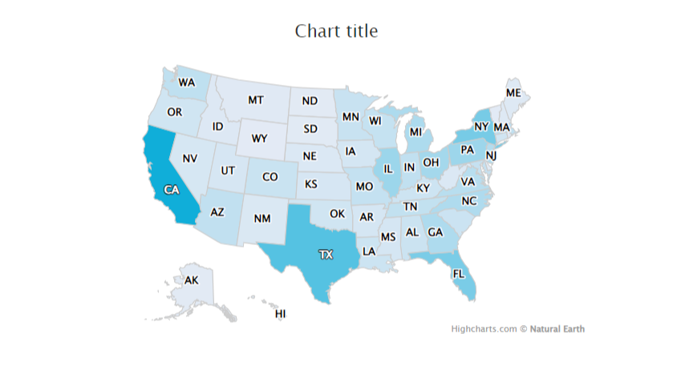
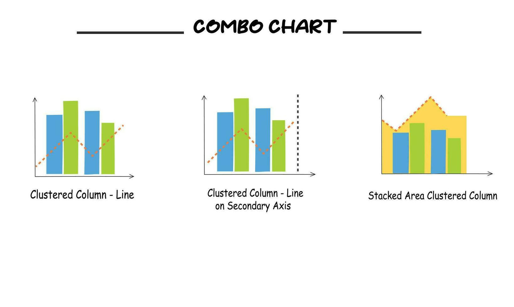

# Data Visualization & Selection Cheat Sheet

Data visualization transforms raw quantitative and categorical structures into visual graphics. Selecting the appropriate visual format depends on variable dimensions, data types (discrete vs. continuous), and the analytical story (distribution, comparison, composition, or relationship).

---

## 1. Visualization Categories

| Category | Definition | Primary Objective | Typical Chart Types |
| --- | --- | --- | --- |
| **Univariate** | Analysis of a single variable ($X$). | Summarize distribution, central tendency, spread, and outlier frequency. | Histogram, Boxplot, Single Column/Bar, KDE Plot. |
| **Bivariate** | Analysis of two variables ($X, Y$). | Uncover relationships, correlations, trend directions, or category comparisons. | Scatter Plot, Line Chart, Clustered Bar/Column, Dual-Axis Combo. |
| **Multivariate** | Analysis of three or more variables ($X, Y, Z, \dots$). | Identify complex multi-dimensional interactions, groupings, and nested structures. | Heatmap, Bubble Chart, Stacked Column/Bar, Treemap, Pair Plot. |

---

## 2. Comprehensive Chart Selection Matrix

| Chart Type | Primary Dimension / Category | When to Use (Use Case & Example) | When NOT to Use (Pitfall & Example) | Image Placeholder |
| --- | --- | --- | --- | --- |
| **Column Chart**<br> *(Single, Clustered, Stacked)* | Univariate / Bivariate / Multivariate | **Single:** 3–7 discrete categories or time steps (*e.g., quarterly revenue $Q_1-Q_4$*).<br> **Clustered:** Sub-group comparisons across 2–4 categories side-by-side (*e.g., regional sales across 3 product lines*).<br> **Stacked:** Total values broken down by relative sub-components (*e.g., total quarterly revenue by department*). | **Single:** >10 categories or long text labels (*e.g., comparing 50 US states*).<br> **Clustered:** >4 sub-groups causing extreme visual noise (*e.g., 10 regions across 12 product lines*).<br> **Stacked:** Precise comparisons of non-baseline sub-segments (*e.g., middle segment sizes across 8 years*). |  |
| **Bar Chart (Horizontal)** | Univariate / Bivariate | **Use:** Comparing categorical values with long label names or ranked items (>7 categories).<br> *Example:* Ranking top 15 customer support issue types by frequency. | **Don't Use:** Time-series trend data (time logically runs left-to-right).<br> *Example:* Monthly sales progression from January to December. |  |
| **Pie / Donut Chart** | Univariate / Bivariate | **Use:** Displaying part-to-whole proportional shares ($100\%$ total) with 2–5 categories max.<br> *Example:* Market share split among 3 main industry competitors. | **Don't Use:** Slices with small variations, non-$100\%$ totals, or >5 categories.<br> *Example:* Comparing 8 budget categories with subtle differences ($12\%$ vs $14\%$). |  |
| **Line Chart** | Bivariate | **Use:** Tracking continuous time-series trends and metric changes over ordered intervals.<br> *Example:* Daily active website users over a 365-day period. | **Don't Use:** Discrete categorical variables without chronological sequence.<br> *Example:* Total profit compared across 5 independent retail stores. | ` |
| **Scatter Plot** | Bivariate / Multivariate | **Use:** Evaluating correlation, clusters, and relationship strength between 2 continuous numerical variables.<br> *Example:* Ad spend ($X$) vs. Sales revenue ($Y$) across 100 marketing campaigns. | **Don't Use:** Discrete categorical targets or simple single-variable trends.<br> *Example:* Annual company profit over 5 discrete years (Line chart is superior). |  |
| **Area Chart** | Bivariate / Multivariate | **Use:** Representing cumulative volume change over continuous time to emphasize magnitude.<br> *Example:* Cumulative network bandwidth usage over 24 hours across 3 servers. | **Don't Use:** Unstacked overlapping datasets where series obscure each other.<br> *Example:* Tracking fluctuating daily stock prices of 4 independent companies. |  |
| **TreeMap** | Multivariate | **Use:** Displaying hierarchical, nested quantitative data across many categories as proportioned rectangles.<br> *Example:* S&P 500 stock market cap organized by industry sector and company size. | **Don't Use:** Small datasets (<5 items) or scenarios requiring precise baseline comparisons.<br> *Example:* Comparing revenue between 3 local store branches. |  |
| **Waterfall Chart** | Bivariate | **Use:** Visualizing sequential positive and negative contributions leading to a net total.<br> *Example:* Net profit bridge from Gross Revenue minus Operating Expenses and Taxes. | **Don't Use:** Static non-sequential component totals without cumulative flow.<br> *Example:* Comparing demographic age distributions across 4 cities. |  |
| **Map (Choropleth / Bubble)** | Bivariate / Multivariate | **Use:** Displaying spatial and geographic distributions of metrics across physical locations.<br> *Example:* Customer density or regional revenue rendered per state or country. | **Don't Use:** Non-geographical datasets or geographic units distorted by land area size.<br> *Example:* Comparing company revenue by internal department team. |  |
| **Combo Chart (Dual-Axis)** | Multivariate | **Use:** Combining 2 distinct metrics with different scales/units over a shared horizontal axis.<br> *Example:* Monthly Sales Volume in USD ($) (Columns) vs. Profit Margin ($%$) (Line). | **Don't Use:** Plotting metrics that share identical units and scales.<br> *Example:* Product A revenue ($) vs. Product B revenue ($) (use standard Multi-Line). |  |

### Quick Decision Summary Table

| Chart Type | Do (When to Use) | Don't (When to Avoid) |
| --- | --- | --- |
| **Column Chart** | 3–7 vertical categories or grouped sub-categories | >10 categories, long label text, or non-baseline comparisons |
| **Bar Chart** | >7 categories, long text labels, or ranked items | Chronological time-series data |
| **Pie / Donut Chart** | Part-to-whole ($100\%$ total) with 2–5 categories max | >5 categories, non-$100\%$ totals, or small variations |
| **Line Chart** | Continuous time-series trends over ordered intervals | Categorical data without a time/sequence connection |
| **Scatter Plot** | Relationship / correlation between 2 continuous numbers | Discrete categorical targets or simple trend-over-time |
| **Area Chart** | Cumulative volume / magnitude change over continuous time | Overlapping unstacked series (blocks view) |
| **TreeMap** | Hierarchical / nested categories with proportional values | Small datasets (<5 items) or precise baseline comparisons |
| **Waterfall Chart** | Sequential positive & negative changes leading to a total | Static independent categories without a sequential flow |
| **Map Chart** | Spatial / geographic distribution across real physical areas | Non-geographical metrics |
| **Combo Chart** | 2 metrics with different units/scales on one X-axis | Metrics that share identical units/scales |

> **Design Rules**
> 1. **Baseline Rule:** Column and bar charts MUST start at a zero-baseline ($0$) on the value axis to avoid visual distortion. Line charts can use zoomed axes to focus on micro-fluctuations.
> 2. **Color Economy:** Use color strictly to encode categorical identity, data values, or highlights. Limit unique color palettes to $\le 6$ distinct hues per chart.

---

# Data Visualization Cheat Sheet: Matplotlib, Seaborn & Plotly Express

A technical reference guide covering data visualization with Matplotlib, Seaborn, and Plotly Express. This sheet summarizes setup, core parameters, chart types, and code implementations for exploratory data analysis.

---

## 1. Setup & Environment Initialization

| Library | Import Convention | Global Setup / Primary Purpose | Interactive? |
| --- | --- | --- | --- |
| **Matplotlib**<br> | `import matplotlib.pyplot as plt`<br> | `%matplotlib inline` (renders plots below notebook cells) | Static |
| **Seaborn**<br> | `import seaborn as sns`<br> | `sns.set_theme(style="whitegrid")` (sets global theme) | Static |
| **Plotly Express**<br> | `import plotly.express as px`<br> | `fig.show()` (renders interactive HTML elements) | Interactive |

---

## 2. Core Visualization Functions & Parameters

### Chart Type Matrix

| Visualization Type | Matplotlib Function | Seaborn Function | Plotly Express Function |
| --- | --- | --- | --- |
| **Scatter Plot** | `plt.scatter(x, y, s, c, alpha, cmap)` | `sns.scatterplot(data, x, y, hue)` | `px.scatter(df, x, y, color, size, hover_data)` |
| **Line Chart** | `plt.plot(x, y, marker, linestyle, color)` | `sns.lineplot(data, x, y, hue)` | `px.line(df, x, y, markers)` |
| **Bar Chart** | `plt.bar(x, height, width, color)` | `sns.barplot(data, x, y, estimator, errorbar)` | `px.bar(df, x, y, color, barmode)` |
| **Pie / Donut Chart** | `plt.pie(x, labels, autopct, wedgeprops)` | *Not directly used* | `px.pie(df, values, names, hole)` |
| **Histogram** | `plt.hist(x, bins, color, edgecolor)` | `sns.histplot(data, x, bins, kde, color)` | *N/A (in notebook)* |
| **Box Plot** | `plt.boxplot(x, vert, labels)` | `sns.boxplot(data, x, y)` | `px.box(df, x, y, points)` |

---

## 3. Matplotlib Syntax Reference

Matplotlib provides low-level, procedural control over figure components.

### Key Method Options

* **`plt.scatter`**: `s` (marker size), `c` (color array/column), `alpha` (transparency 0–1), `cmap` (color map string).
* **`plt.plot`**: `marker` (point shape, e.g., `'o'`), `linestyle` (line format, e.g., `'-'`), `color` (line color).
* **`plt.pie`**: `autopct` (percentage format, e.g., `'%1.1f%%'`), `wedgeprops=dict(width=0.4)` (creates a donut chart).
* **`plt.boxplot`**: `vert` (boolean for orientation; `False` sets horizontal).

```python
import matplotlib.pyplot as plt

# 1. Scatter Plot with Colorbar
plt.scatter(df['CustomerAge'], df['Revenue'], alpha=0.7, c=df['Quantity'], cmap='viridis')
plt.xlabel('Customer Age')
plt.ylabel('Revenue')
plt.colorbar(label='Quantity')
plt.title('Revenue VS Customer Age')
plt.show()

# 2. Line Chart (Aggregated Data)
daily_revenue = df.groupby('OrderDate')['Revenue'].sum()
plt.plot(daily_revenue.index, daily_revenue.values, marker='o', linestyle='-', color='steelblue', label='Revenue')
plt.xlabel('Date')
plt.ylabel('Revenue')
plt.legend()
plt.show()

# 3. Bar Chart
revenue_by_region = df.groupby('Region')['Revenue'].sum()
plt.bar(revenue_by_region.index, revenue_by_region.values, color='skyblue', width=0.3)
plt.title('Revenue by Region')
plt.show()

# 4. Donut Chart
revenue_by_category = df.groupby('Category')['Revenue'].sum()
plt.pie(revenue_by_category.values, labels=revenue_by_category.index, autopct='%1.1f%%', wedgeprops=dict(width=0.4))
plt.title('Revenue by Category')
plt.show()

# 5. Histogram
plt.hist(df['SatisfactionScore'], bins=5, color='mediumseagreen', edgecolor='black')
plt.title('Distribution of Satisfaction Scores')
plt.show()

# 6. Horizontal Box Plot
groups = [df.loc[df['Category'] == cat, 'Revenue'] for cat in df['Category'].unique()]
plt.boxplot(groups, labels=df['Category'].unique(), vert=False)
plt.title('Revenue by Category')
plt.show()
```

---

## 4. Seaborn Syntax Reference

Seaborn accepts DataFrames directly and handles aggregations or groupings natively via semantic parameters.

### Key Method Options

* **`hue`**: Groups data by a categorical variable using distinct colors.
* **`estimator`**: Statistical aggregation function for bar plots (e.g., `'sum'`, `'mean'`).
* **`errorbar`**: Controls error bars (set to `None` to disable).
* **`kde`**: Set to `True` on `histplot` to overlay a Kernel Density Estimate curve.

```python
import seaborn as sns
import matplotlib.pyplot as plt

sns.set_theme(style="whitegrid")

# 1. Scatter Plot with Grouping
sns.scatterplot(data=df, x="CustomerAge", y="Revenue", hue="Region")
plt.title('Revenue VS Customer Age')
plt.show()

# 2. Line Plot
daily = df.groupby('OrderDate', as_index=False)['Revenue'].sum()
sns.lineplot(data=daily, x='OrderDate', y='Revenue')
plt.xticks(rotation=45)
plt.title('Revenue Over Time')
plt.show()

# 3. Bar Plot with Aggregation
sns.barplot(data=df, x='Region', y='Revenue', estimator='sum', errorbar=None)
plt.title('Revenue by Region')
plt.show()

# 4. Histogram with KDE
sns.histplot(data=df, x='SatisfactionScore', bins=10, kde=True, color='mediumseagreen')
plt.title('Distribution of Satisfaction Scores')
plt.show()

# 5. Box Plot
sns.boxplot(data=df, x='Category', y='Revenue')
plt.title('Revenue by Category')
plt.show()
```

---

## 5. Plotly Express Syntax Reference

Plotly Express creates interactive plots using DataFrame inputs.

### Key Method Options

* **`hover_data`**: List of additional column names to display on hover tooltips.
* **`size`**: Scales marker size based on a numerical column.
* **`barmode`**: Defines bar alignment (e.g., `'group'` for side-by-side grouped bars).
* **`hole`**: Fractional value (0 to 1) defining the center hole radius for pie charts to create a donut chart.
* **`points`**: Outlier display mode in box plots (e.g., `'outliers'`, `'all'`).

```python
import plotly.express as px

# 1. Interactive Scatter Plot
fig = px.scatter(df, x='CustomerAge', y='Revenue', color='Region', hover_data=['Category'], size='Quantity', title='Revenue VS CustomerAge')
fig.show()

# 2. Interactive Line Plot with Markers
fig = px.line(daily, x='OrderDate', y='Revenue', title='Revenue Over Time', markers=True)
fig.show()

# 3. Grouped Bar Chart
revenue_by_reg_cat = df.groupby(['Region', 'Category'], as_index=False)['Revenue'].sum()
fig = px.bar(revenue_by_reg_cat, x='Region', y='Revenue', color='Category', barmode='group', title='Revenue by Region and Category')
fig.show()

# 4. Interactive Box Plot
fig = px.box(df, x='Category', y='Revenue', points='outliers', title='Revenue by Category')
fig.show()

# 5. Donut Chart
fig = px.pie(revenue_by_category, values='Revenue', names=revenue_by_category.index, hole=0.7, title='Revenue by Category')
fig.show()
```